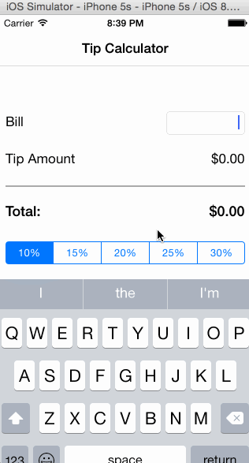

# tipCalculator
[iOS class] - Tip Calculator project

##### How many hours did it take to complete?
* 1h: learn objective-c syntax
* 2h: finish the project by following the video instruction

##### Which required and optional stories have you completed?
* The app needs to have a header title called "Tip Calculator"
* The app calculates total amount from bill amount and tips percentage
* User can easily change tips percentage from 10% - 30%
* The total amount is updated automatically by tapping anywhere of the app or a specific segment control element

##### GIF walkthrough of all required and optional stories

